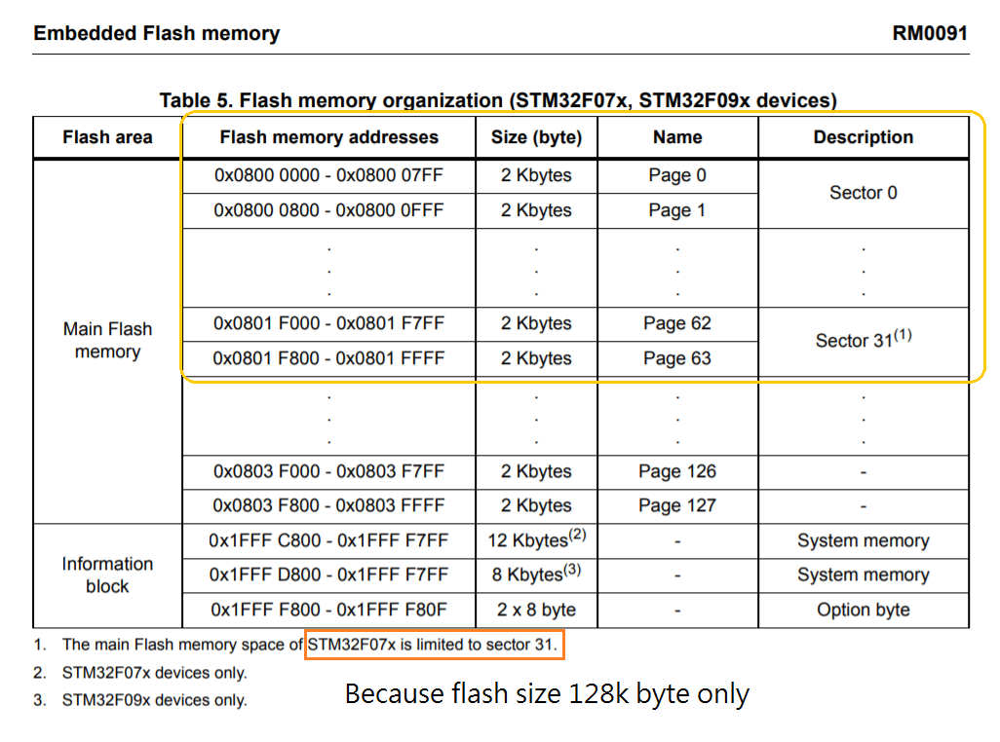
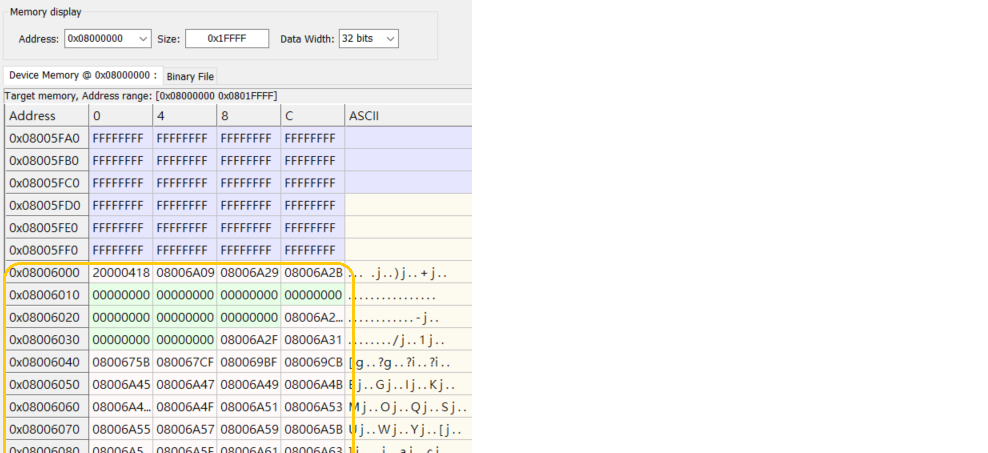
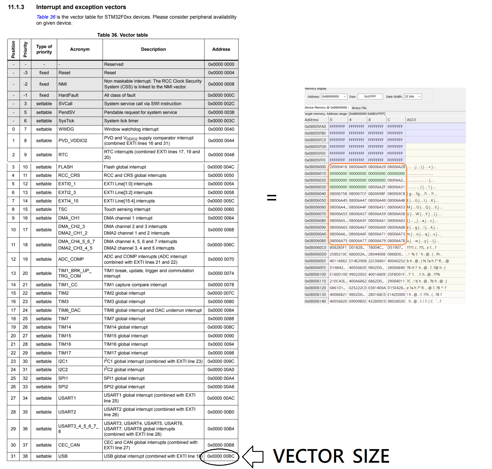
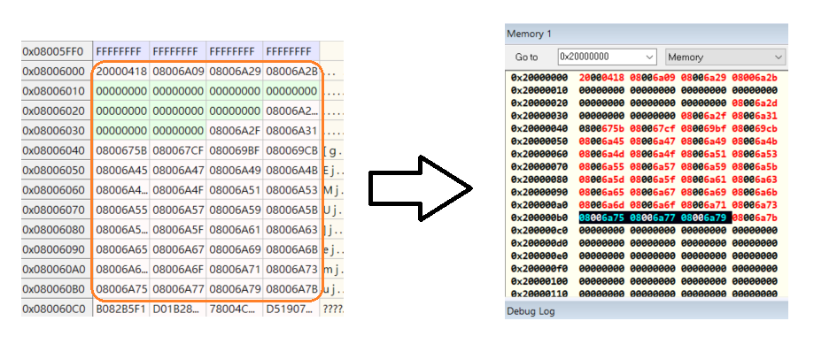

# STM32F072_Application

[TOC]


# STM32F0系列Bootloader設計

## 開發環境:

IDE:  IAR Embedded Workbench 8.20.1

MCU型號: STM32F072RBT6

參考文件: RM0091 [STM32F0x1/STM32F0x2/STM32F0x8 advanced ARM®-based 32-bit MCUs]

輔助軟體: STM32 ST-LINK Utility

文件下載地址:https://www.st.com/en/microcontrollers-microprocessors/stm32f072rb.html#documentation

___


# APP篇:

## STEP 1  IAR修改ROM Flash起始位置

本範例Application 起始位置: 0x08006000 

		由ST官方文件可知 F07x系列的Flash最小只能以2Kbytes 為單位erase ,因此請將Application起始地址請以0x800為單位偏移
	
	    本範例起始位置0x08006000 表示偏移12個Page燒錄Application         

####  Flash Memory Table




專案->Option->Linker->[config]->[Edit...]

---

#### Vector Table

.intvec start  [0x08006000] 

---

#### Memory Regions

|      |   Start:   |    End:    |
| :--: | :--------: | :--------: |
| ROM  | 0x08006000 | 0x0801FFFF |
| RAM  | 0x20000000 | 0x20003FFF |

備註:  0x20003FFF => (16kbyte)

---

修改之後bin檔就會從Flash Address 0x08006000開始進行燒錄




## STEP 2 複製Vector Table內容到SRAM

做了Step1後只是將Firmware(ROM)燒到我們想要的Flash地址,還要將Vector Table(中斷向量地址表)內容複製到SRAM起始位置(0x20000000)程式才能正常動作

#### 取得VECTOR_SIZE

請參考文件RM0091 搜尋 Vector table



	備註: 程式必須要知道系統的中斷向量在什麼位置,才能正確的執行,所以才需要將他複製到SRAM裡面
	
	          而我們的Firmware(ROM)開頭其實就是中斷向量(Vector Table),至於大小就會因為型號不同而有所不同

#### 程式碼

```c
//main.c  (Application)
/* Private define ------------------------------------------------------------*/
/* USER CODE BEGIN PD */
#define APPLICATION_ADDRESS  ((uint32_t)0x08006000) 
/* USER CODE END PD */

```

```c
//main.c  (Application)
/* USER CODE BEGIN PFP */

#pragma location = 0x20000000
__no_init __IO uint32_t VectorTable[48];

void vector_table_and_remap(void)
{
      for( uint32_t i = 0; i < 48; i++){
          VectorTable[i] = *(__IO uint32_t*)(APPLICATION_ADDRESS + (i<<2));
      }      
      __HAL_RCC_SYSCFG_CLK_ENABLE();      
      __HAL_SYSCFG_REMAPMEMORY_SRAM();     
}
/* USER CODE END PFP */
```

```c
//main.c  (Application)
int main(void)
{
  /* USER CODE BEGIN 1 */
  vector_table_and_remap();
  /* USER CODE END 1 */

  /* MCU Configuration--------------------------------------------------------*/

  /* Reset of all peripherals, Initializes the Flash interface and the Systick. */
  HAL_Init();
  //other init...
  //other init...
  //other init...

```

#### 實際動作


# Bootloader篇:

## STEP 1 Bootloader切換到Application

開一個全新的專案命名為Projectxxxx_bootoader跟Application專案區別開

#### 定義Application起始地址

```c
//main.c (Bootloader)
/* USER CODE BEGIN PD */
#define APPLICATION_ADDRESS   (uint32_t)0x08006000         
/* USER CODE END PD */
```

#### 建立跳轉Function

```c
//main.c (Bootloader)
typedef  void (*pFunction)(void);
pFunction JumpToApplication;
uint32_t  JumpAddress;

void F_Jump_To_Application(void){
        
    if (((*(__IO uint32_t*)APPLICATION_ADDRESS) & 0x2FFE0000 ) == 0x20000000)
    {
      /* Jump to user application */
      JumpAddress = *(__IO uint32_t*) (APPLICATION_ADDRESS + 4);
      JumpToApplication = (pFunction) JumpAddress;
      /* Initialize user application's Stack Pointer */
      __set_MSP(*(__IO uint32_t*) APPLICATION_ADDRESS);
      JumpToApplication();
    }    
  
}
```


#### 呼叫轉跳Function

在main裡呼叫F_Jump_To_Application  就可以轉跳到上面寫的Application了

```c
//main.c (Bootloader)
int main(void)
{
  /* USER CODE BEGIN 1 */
  /* USER CODE END 1 */

  /* MCU Configuration--------------------------------------------------------*/
  /* Reset of all peripherals, Initializes the Flash interface and the Systick. */
  HAL_Init();
  /* USER CODE BEGIN Init */
  /* USER CODE END Init */
  /* Configure the system clock */
  SystemClock_Config();
  /* USER CODE BEGIN SysInit */
  /* USER CODE END SysInit */
  /* Initialize all configured peripherals */
  MX_GPIO_Init();
  MX_USART4_UART_Init();
  /* USER CODE BEGIN 2 */
  F_Jump_To_Application();  
  //other code...
  //other code...
  //other code...   
```

#### 內部FLASH  "抹除"

指定地址開始以Page(2K byte)為單位抹除內部Flash

```c
void Erase_Flash_Pages( uint32_t FLASH_ADDRESS , uint8_t PageAmount ){
    
    FLASH_EraseInitTypeDef EraseInitStruct;
    uint32_t  PageError;
    HAL_FLASH_Unlock(); //Flash unlock
    
    do{
        EraseInitStruct.TypeErase = FLASH_TYPEERASE_PAGES;  //Set Erase type: page           
        EraseInitStruct.PageAddress = FLASH_ADDRESS;        //Set start page address  
        EraseInitStruct.NbPages = PageAmount;
    }while(HAL_FLASHEx_Erase(&EraseInitStruct, &PageError) != HAL_OK);
    
    HAL_FLASH_Lock();
}

```

#### 內部FLASH "寫入"

指定地址寫入一個WORD長度(4 byte)的資料

```c
uint8_t Write_FLASH_WORD(uint32_t FLASH_ADDRESS, uint32_t Data){

    uint8_t RESULT = 0;    
    HAL_FLASH_Unlock();    
    if (HAL_FLASH_Program(FLASH_TYPEPROGRAM_WORD, FLASH_ADDRESS, Data) == HAL_OK){
        uint32_t  uiWriteCheck = *(__IO uint32_t *)(FLASH_ADDRESS);
        if(uiWriteCheck == Data) RESULT = 1; 
    }
    HAL_FLASH_Lock();
    return RESULT;
}
```

#### 內部FLASH "讀取"

讀取指定FLASH地址資料

```c
uint32_t  uiREAD_WORD  = *(__IO uint32_t*)(FLASH_ADDRESS);
uint16_t  uiREAD_SHORT = *(__IO uint16_t*)(FLASH_ADDRESS);
uint8_t   uiREAD_BYTE  = *(__IO uint8_t*)(FLASH_ADDRESS);

```
